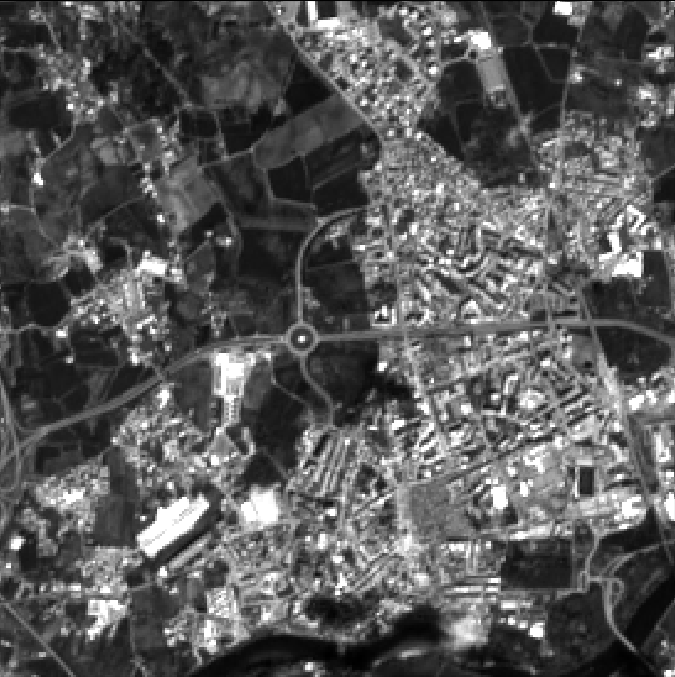
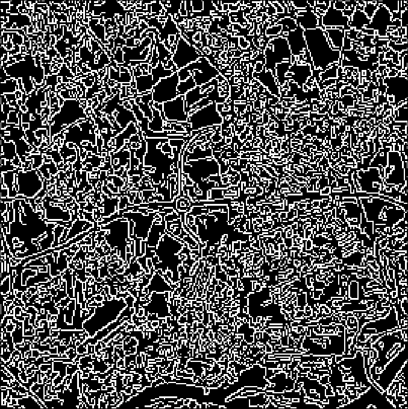
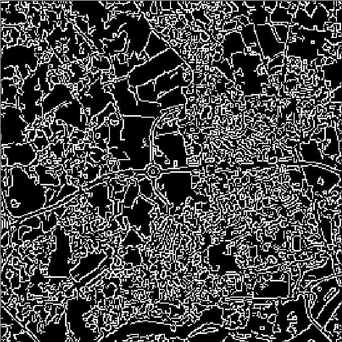
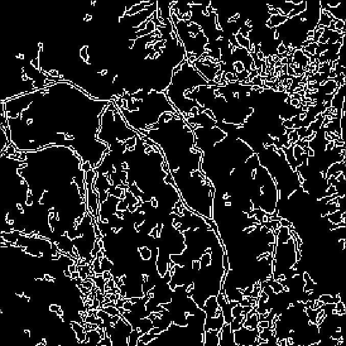
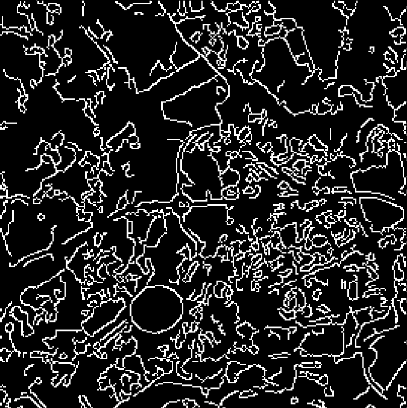
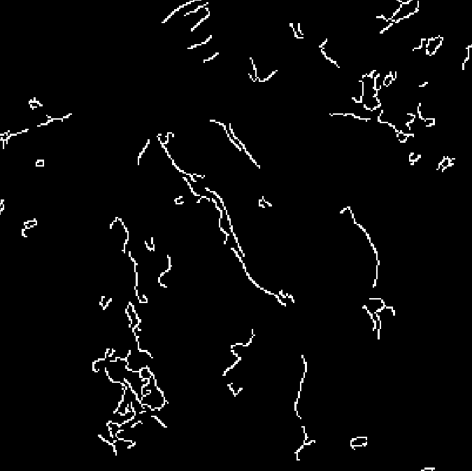

# Tecnologias e Aplicações

## Segmentação de estradas em imagens do Sentinel-2

#### Leandro Salgado - A70949
#### Luís Costa - A73434

### Descrição do problema

O objetivo deste trabalho é obter, tanto quanto possível, um "mapa" de estradas a partir do processamento de um conjunto de imagens provenientes do satélite Sentinel-2, utilizando para isso técnicas de processamento de imagem com a ajuda da ferramenta **OpenCV** no **Python**.

A segmentação de estradas é um problema complexo, cuja resolução passa muitas vezes pela utilização de técnicas que envolvem *deep learning*. Devido a esta complexidade, os resultados esperados neste trabalho não representam uma solução definitiva de segentaação de estradas, mas antes uma tentativa de obter imagens que possuam alguma informação acerca das estradas recorrendo a métodos como operações morfológicas, segmentação de *Canny*, equalização de histogramas, correção de *gamma* (*gamma correction*) e métodos para detetar zonas muito claras numa imagem, para poder excluir objetos como nuvens e telhados de casas mais claros.

### Implementação

Utilizando a linguagem **Python**, foi implementada uma técnica baseada no algoritmo de *Canny*.
A técnica passa pelo uso da segmentação de *Canny* para detetar estradas, pois este algoritmo é especialmente eficaz na deteção de zonas com elevada frequência, i.e., bordas. Uma vez que as intensidades das estradas são diferentes do meio que as rodeia, essa variação deve ser detetada pelo algoritmo de *Canny*.

A técnica é aplicada à imagem toda, mas devido à dimensão dessa imagem o grupo optou por fazer a sua divisão em várias partes mais pequenas e processar cada uma delas da mesma forma, para que seja possível avaliar os resultados dos algoritmos. Cada imagem apresentada nos exemplos é uma secção destas retirada da imagem original do satélite.

Para tomar a decisão de qual ou quais as imagens a usar, o grupo utilizou o **QGIS** para ler as imagens *.jp2* descarregadas do projeto *Copernicus* e tentou determinar quais tinham as propriedades mais indicadas para o projeto. A imagem utilizada foi a **TCI**, que é constituida pelas bandas correspondentes a **RGB** (B02, B03 e B04), já que essas as que os membros do grupo estão mais habituados a trabalhar.

A aplicação, denominada *canny.py*, lê da pasta *R10m* a imagem adequada e recebe três argumentos que determinam se a imagem processada deve sofrer uma equalização do histograma, se deve sofrer uma *gamma correction* ou se devem ser detetados os pontos de intensidade mais elevada e elminar esses mesmos pontos (as três opções podem ser escolhidas em simultâneo).

#### Funções e APIs usadas

Para poder aplicar os algoritmos necessários, tivemos de recorrer à API *gdal*, que é usada para ler os ficheiros *.jp2*. Para além dessa,usamos **APIs** comuns como *numpy*, *cv2* e *matplotlib*.

As função principal do programa é a *segment_roads*, que divide a imagem em partes mais pequenas e itera por cada uma aplicando o algoritmo de segmentação.

A função *process_canny* e *process_morphology* processam a imagem recebida de forma a produzir uma imagem com a segmentação efetuada, mas usando métodos distintos (será detalhado à frente).

Embora o foco do projeto tenha sido no *Canny*, as operações morfológicas consituem outra técnica que foi levemente explorada pelo grupo.

#### Algoritmo de Canny

O problema que surge quando se aplica o algoritmo de *Canny* resulta da possível deteção de bordas noutras partes da imagem que também tenham variações bruscas de intensidades (altas frequências). Devido à sensibilidade do algoritmo a zonas de alta frequência, zonas com casas com cores muito diferentes ou com nuvens são passíveis de serem detetadas como sendo estradas, o que resulta numa imagem que não representa só as estradas. Para tentar combater esse problema, tentamos aplicar uma série de técnicas para tentar diminuir as deteções do algoritmo.

Como foi sugerido no enunciado do projeto (num dos *links* apontados), tentamos fazer uma equalização do histograma para melhor ditribuir as diferentes intensidades. No entanto, a utilização desta técnica piorou os resultados, resultando numa imagem com demasiadas deteções.

  
  

A equalização do histograma, uma vez que resultou numa imagem com imensas deteções, não foi usada. De seguida, foi feita uma *gamma correction* para tentar melhorar o contraste da imagem, para que as estradas pudessem ter um maior contraste enquanto o resto teria um contraste diminuído. Esta operação resulta numa imagem um pouco melhor do que aplicando o *Canny* na imagem original, mas mesmo assim ainda sofre do problema da deteção de vários objetos diferentes que não correspondem a estradas.

Para além da equalização e de *gamma correction*, há ainda uma outra técnica que foi usada que corresponde à deteção de pontos claros na imagem. Essa função, quando aplicada, remove as partes mais claras da imagem. Como as estradas não têm intensidades próximas das apresentadas nas nuvens, em princípio não ocorrerá em nenhum caso a eliminação de estradas da imagem.

Depois de fazer a *gamma correction*, a imagem ficou da seguinte forma:

  
  

Outro exemplo (sem nuvens):

  
  

Como se pode ver nos dois exemplos, o problema nas deteções, em grande parte, continua a ser as casas que têm muito contraste com o meio envolvente. Teriam de ser usados métodos mais sofisticados de processamento de imagem para conseguir obter melhores resultados.

Numa tentativa final de melhorar os resultados diminuindo as frequências gerais da imagem, foi passado um filtro passa-baixo (gaussiano) com o *kernel* de 5 por 5. Como esse filtro diminui a variação brusca das intensidades em píxeis adjacentes, o resultado consiste numa menor frequência geral e, assim, na menor deteção de bordas pelo algoritmo.

As imagens seguintes correspondem às imagens anteriores com a única alteração sendo a passagem do resultado, antes do algoritmo de *Canny* ser aplicado, de um filtro passa-baixo:

  
  

  
  

A última imagem sofreu uma perda considerável das estradas porque o filtro passa-baixo fez um *blur* demasiado elevado na imagem original,resultando numa borda demasiado suave para ser detetada.

#### Algoritmo com operações morfológicas

Embora não tenha sido mostrado neste *readme*, uma vez que os resultados não tinham grande qualidade, foi também implementado um outro método denominado *process_morphology* que tenta fazer a segmentação recorrendo a operações morfológicas e não com o algoritmo de *Canny*. Para que tal possa ser executado, basta modificar a função *segment_roads* para invocar, no ciclo, a função *process_morphology* em vez da função *process_canny*.

### Conclusão e discussão de resultados

Embora as opeações usadas sejam capazes de detetar estradas, caem também no problema de detetarem demasiados objetos indesejáveis. As estratégias usadas correspondem a soluções que, em certos casos, resolvem alguns dos problemas, não conseguindo no entanto detetar de forma significativa os diferentes tipos de estradas noutros casos. Consegue-se concluir que o algoritmo funciona melhor nos casos em que há menos casas e outros tipos de edifícios e onde a presença de regiões campais é forte, como se pode ver nos exemplos mostrados.
Embora no enuciado seja referido que a comparação dos resultados pode ser feita de novo no **QGIS** juntamente com imagens do *OpenStreetMap*, o grupo teve dificuldades na implementação de um mecanismo que conseguisse voltar a guardar a imagem processada em formato *raster*, por isso a comparação não foi efetuada dessa forma.

Podemos concluir que os melhores resultados foram obtidos através da aplicação da *gamma correction* e da deteção de pontos de elvada intensidade, sendo que em certos casos os resultados são melhorados aplicando um filtro passa-baixo antes de aplicar o algoritmo de *Canny*.

Uma vez que, tal como foi já referido, o processo de segmentação de estradas é extremamente complexo, e uma vez que o grupo não tem conhecimento muito extensos de técnicas sofisticadas para implementar uma segmentação sofisticada, os resultados não representam o que seria de esperar de uma aplicação mais refinada. É também importante de salientar que as imagens utilizadas apresentam níveis de contraste que dificultam bastante a identificação de estradas, o que dificultou todo o processo. Assim, embora os resultados não sejam os melhores, o grupo considera que conseguiu implementar em parte o que era pedido.