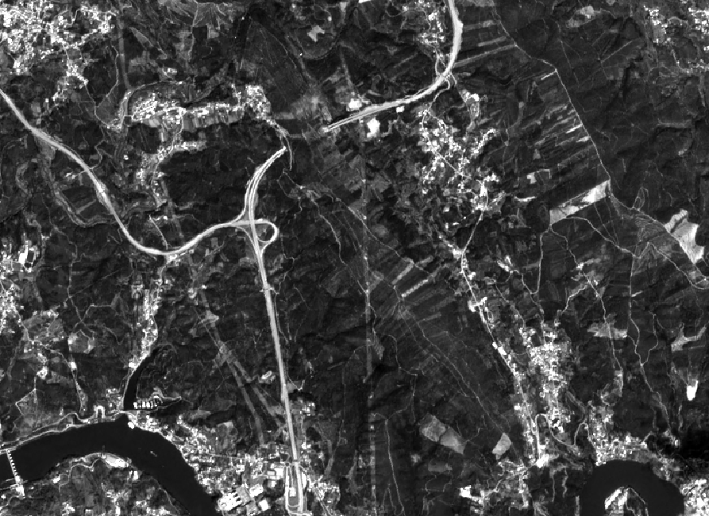
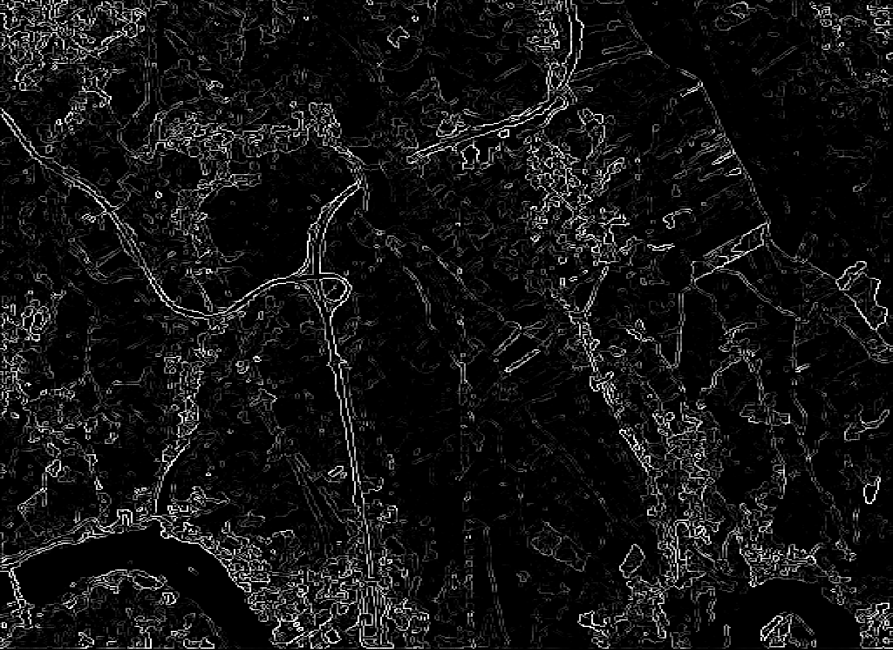
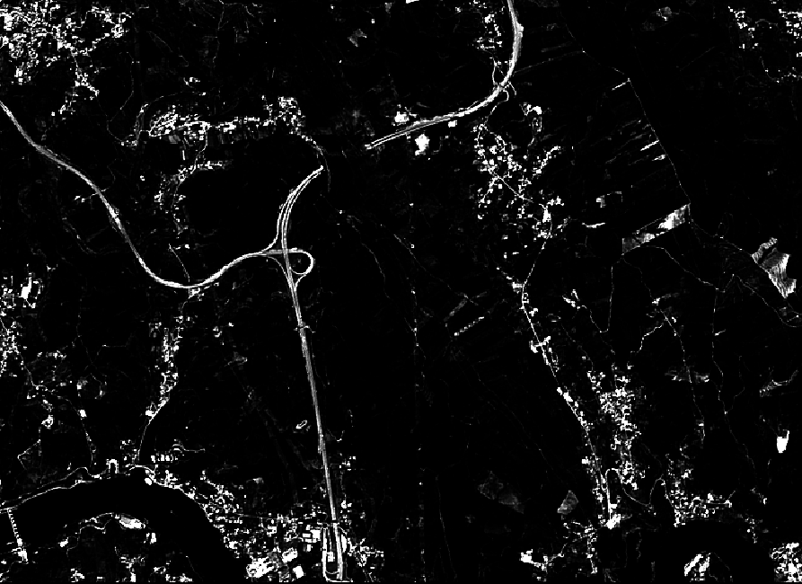
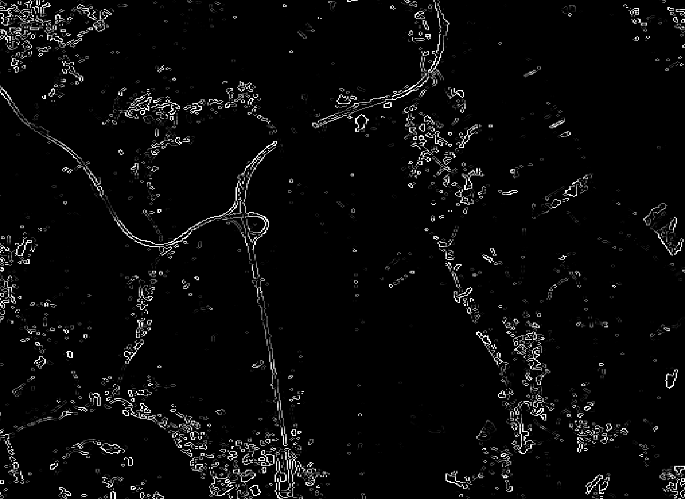
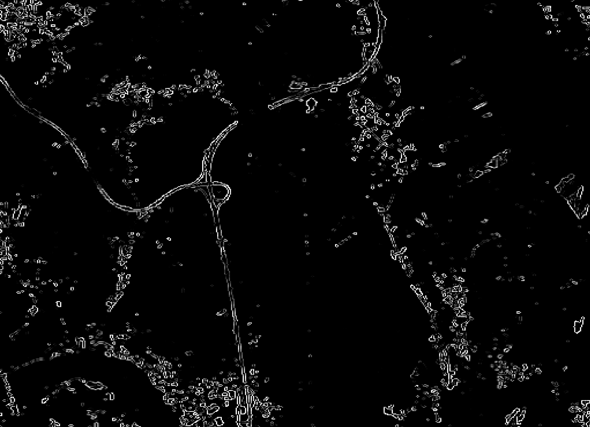

# Tecnologias e Aplicações

## Processamento de imagens de satélite

### Trabalho realizado por:
#### João Miguel da Silva Carvalho (pg35392)
#### José Miguel Gonçalves Oliveira (pg33873)
#### Tiago Manuel Sampaio Branco (pg35391)

 

### Introdução

Este trabalho tinha como principal objetivo processar imagens do satélite Sentinel-2, usando a ferramenta **OpenCV** no **Python**. Desta forma conseguir-se-ia obter um mapa das estradas.

Processou-se as imagens do satélite, segmentando-as com o algoritmo de *Canny*, e aplicou-se uma equalização de histogramas, correção de *gamma* (*gamma correction*) e métodos para detetar zonas muito claras numa imagem, para poder excluir objetos como nuvens e telhados de casas mais claros.

 

### Implementação

Recorrendo ao Python, foi implementada uma técnica baseada no algoritmo de *Canny*.
A técnica passa pelo uso da segmentação de *Canny* para detetar estradas, pois este algoritmo é especialmente eficaz na deteção de zonas com elevada frequência.

Dado que as imagens são bastante grandes, decidiu-se processar apenas uma parte das imagens. As imagens apresentadas são, como referido, uma secção do mapa completo obtido do satélite.

Utilizou-se o **QGIS** para ler as imagens *.jp2* descarregadas do projeto *Copernicus* e escolheu-se a imagem **B04**, pois já se econtra em tons de cinza, o ideal para trabalhar em processamento de imagem.

  

Dada a baixa qualidade das imagens, primeiro procedeu-se a um melhoramento das arestas da imagem usando uma matriz 5x5.
Abaixo está a comparação entre essas duas imagens.

  
  

O programa *segmentation.py* lê a imagem e recebe três argumentos que determinam se a imagem processada deve sofrer uma equalização do histograma, se deve sofrer uma *gamma correction* ou se devem ser detetados os pontos de intensidade mais elevada e elminar esses mesmos pontos (as três opções podem ser escolhidas em simultâneo).

Abaixo segue-se um exemplo de uma imagem com o algoritmo de *Canny* aplicado.

  
  

De seguida, foi feita uma *gamma correction* para tentar melhorar o contraste da imagem, fazendo sobressair as estradas.

Depois de fazer a *gamma correction*, a imagem ficou da seguinte forma:

  
  

Abaixo fica a comparação entre os dois *Canny* (Imagem original e com contraste melhorado).

É possível verificar que efetuar um *gamma correction*, reduziu o ruído na imagem.

  
  

Para melhorar os resultados, diminuiram-se as frequências gerais da imagem, com um filtro passa-baixo (gaussiano) com uma matriz 5x5. Esse filtro diminui a variação das intensidades e assim, há uma melhor deteção da bordas.

As imagens seguintes comparam a imagem com *gamma correction*, o *canny dessa* e o filtro gaussiano da imagem *gamma* com *canny*

  
  
  

### Discussão e Conclusão

Um dos grande problemas de detetar as estradas com as imagens de satélite obtidas, passou pelo facto de estas terem muito baixa qualidade quando se aproximava de uma estrada.

Por isso, os resultados finais não são perfeitos, já que para além da baixa qualidade, as deteções de bordas usando o algoritmo de *canny* resultam de imagens com algum ruído.

Aliado a isso, não existem conhecimentos para efetuar um processamento complexo que retorne melhores resultados. Também não foi possível comparar os resultados com o **QGIS** e *OpenStreetMape*. Contudo, é possível verificar que em parte, as estradas foram detetadas.

Assim sendo, parte dos objetivos do projeto, foram implementados. 
